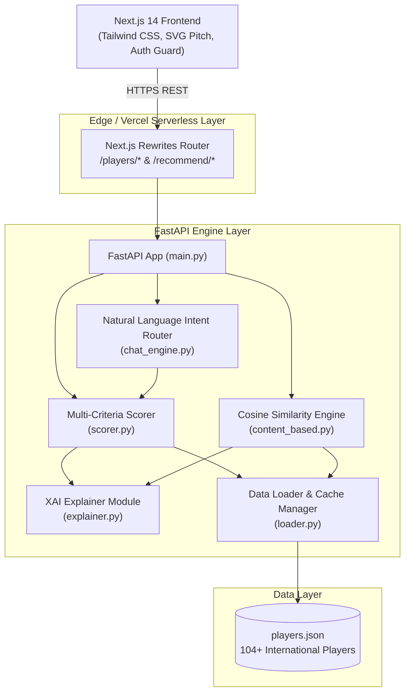
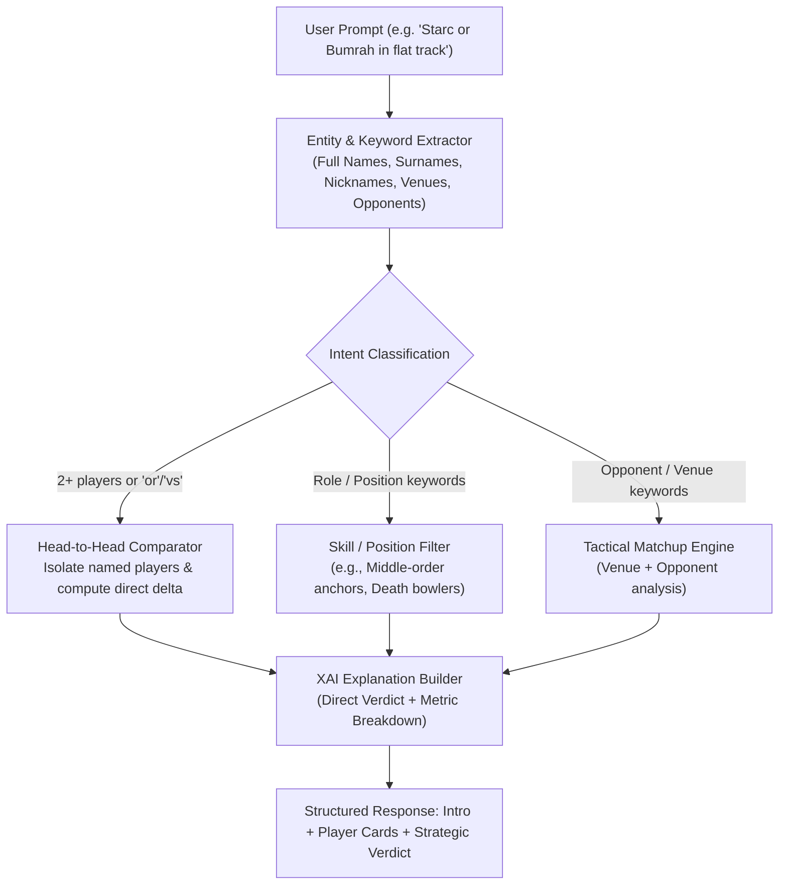

# 🏏 CricketIQ — Production System Documentation & Architecture Guide

> **Intelligent Cricket Player Recommendation Engine & Tactical Decision Support Platform**  
> 🌐 **Live Production URL:** [https://cricketiq-analytics.vercel.app](https://cricketiq-analytics.vercel.app)  
> 📂 **GitHub Repository:** [https://github.com/Rituraj2323/Cricket-Iq](https://github.com/Rituraj2323/Cricket-Iq)

---

## 📑 Table of Contents
1. [Executive Summary & Problem Statement](#1-executive-summary--problem-statement)
2. [System Architecture & Data Flow](#2-system-architecture--data-flow)
3. [Mathematical Recommendation Models](#3-mathematical-recommendation-models)
   - [3.1 Multi-Criteria Weighted Decision Engine (CRIC-SELECT)](#31-multi-criteria-weighted-decision-engine-cric-select)
   - [3.2 Opponent & Venue Contextual Match-Up Scorer](#32-opponent--venue-contextual-match-up-scorer)
   - [3.3 High-Dimensional Cosine Similarity (Player Profiling)](#33-high-dimensional-cosine-similarity-player-profiling)
4. [Explainable AI (XAI) & Heuristic Natural Language Engine](#4-explainable-ai-xai--heuristic-natural-language-engine)
5. [Frontend Engineering & Interactive Analytics UI](#5-frontend-engineering--interactive-analytics-ui)
6. [API Specification & Contract](#6-api-specification--contract)
7. [Deployment & Infrastructure](#7-deployment--infrastructure)
8. [Interview Walkthrough & Key Talking Points](#8-interview-walkthrough--key-talking-points)

---

## 1. Executive Summary & Problem Statement

### 1.1 The Domain Challenge
In modern international cricket, raw statistics (averages, strike rates, career totals) fail to reflect **situational efficacy**. A batsman averaging 45.0 in the subcontinent may struggle on seaming overseas tracks; a death-over bowler with a 7.2 career economy might lack effectiveness on high-scoring flat tracks.

Cricket analysts, team management, and fantasy platforms face three critical bottlenecks:
1. **Multidimensional Trade-offs:** Balancing role compatibility, recent form, match requirements, and player consistency simultaneously.
2. **Context Blindness:** Standard metrics ignore venue geography (e.g., Ahmedabad vs. Lord's) and opponent conditions (subcontinent vs. overseas).
3. **Lack of Explainability:** Black-box machine learning systems fail to provide coaches and stakeholders with actionable "why" explanations.

### 1.2 The CricketIQ Solution
**CricketIQ** is an end-to-end tactical recommendation and analytics platform that bridges raw data and strategic team selection. Built on a dataset of 104+ international players across T20I, ODI, and Test formats, it delivers:
- **CRIC-SELECT Multi-Criteria Engine:** Configurable 5-dimensional weighted ranking.
- **Match-Up AI Engine:** Venue- and opponent-aware tactical selection.
- **Direct Head-to-Head Comparator:** Isolated entity evaluation (e.g., *"Starc vs. Bumrah on a flat track"*).
- **Interactive Visualizations:** 2D pitch views, quadrant scatter matrices, and match-by-match trend curves.

---

## 2. System Architecture & Data Flow



---

## 3. Mathematical Recommendation Models

### 3.1 Multi-Criteria Weighted Decision Engine (CRIC-SELECT)
The recommendation score $S_{\text{total}} \in [0, 100]$ is computed as a linear combination of 5 normalized sub-scores:

$$S_{\text{total}} = w_1 \cdot S_{\text{role}} + w_2 \cdot S_{\text{form}} + w_3 \cdot S_{\text{perf}} + w_4 \cdot S_{\text{req}} + w_5 \cdot S_{\text{cons}}$$

$$\text{subject to } \sum_{i=1}^{5} w_i = 1.0, \quad w_i \ge 0$$

#### Weight Profiles:
| Priority Profile | $w_{\text{role}}$ (Role) | $w_{\text{form}}$ (Form) | $w_{\text{perf}}$ (Perf) | $w_{\text{req}}$ (Req) | $w_{\text{cons}}$ (Cons) |
|---|:---:|:---:|:---:|:---:|:---:|
| **Balanced** | 0.30 | 0.25 | 0.20 | 0.15 | 0.10 |
| **Recent Form** | 0.25 | 0.35 | 0.20 | 0.10 | 0.10 |
| **Strike Rate** | 0.25 | 0.20 | 0.35 | 0.10 | 0.10 |
| **Economy Rate**| 0.25 | 0.20 | 0.35 | 0.10 | 0.10 |
| **Consistency** | 0.25 | 0.20 | 0.15 | 0.10 | 0.30 |
| **Match-Up**    | 0.30 | 0.25 | 0.20 | 0.15 | 0.10 |

#### Component Formulas:
1. **Role Match ($S_{\text{role}}$):**
   $$S_{\text{role}} = \min\left(100, \frac{|T_{\text{player}} \cap T_{\text{target}}|}{|T_{\text{target}}|} \cdot 100 + 10 \cdot |T_{\text{player}} \cap T_{\text{target}}|\right)$$
   Where $T_{\text{target}}$ is the required tag set (e.g. `['death_bowler', 'yorker_specialist']`).

2. **Performance Score ($S_{\text{perf}}$):**
   - **For Bowlers:**
     $$S_{\text{perf}} = \min\left(100, \max\left(0, \frac{10.0 - \text{Economy}}{4.0}\right) \cdot 60 + \min(40, \frac{\text{Wickets}}{3})\right)$$
   - **For Batsmen (Balanced):**
     $$S_{\text{perf}} = \min\left(100, \frac{\text{Avg}}{60} \cdot 60 + \frac{\text{SR} - 80}{120} \cdot 40\right)$$

3. **Requirement Score ($S_{\text{req}}$):**
   Evaluates format compatibility (+30), pitch preference (+30), and geographic condition match (+20).

4. **Consistency Score ($S_{\text{cons}}$):**
   $$S_{\text{cons}} = \min\left(100, \min(50, 1.5 \cdot \text{50s} + 5.0 \cdot \text{100s}) + 0.5 \cdot \text{Overall Rating}\right)$$

---

### 3.2 Opponent & Venue Contextual Match-Up Scorer
When a specific opponent and venue are requested:
1. **Venue Soil/Pitch Classification:**
   - *Chennai, Kolkata, Karachi, Mirpur* $\rightarrow$ **Spinning Track**
   - *Lord's, Edgbaston, Headingley, Cape Town* $\rightarrow$ **Seaming Track**
   - *Perth, Johannesburg, Auckland* $\rightarrow$ **Bouncy Track**
   - *Default / Ahmedabad / Mumbai* $\rightarrow$ **Flat Batting Track**
2. **Opponent Condition Matrix:**
   - Subcontinent teams $\rightarrow$ `subcontinent` baseline.
   - SENA teams (AUS, ENG, SA, NZ) $\rightarrow$ `overseas` baseline.
3. **Opponent Tactical Delta:**
   $$S_{\text{matchup}} = \min(100, S_{\text{cric\_select}} + \delta_{\text{opp}})$$
   Where $\delta_{\text{opp}} = +10.0$ if the player has direct preference in that condition, $+5.0$ if all-condition capable.

---

### 3.3 High-Dimensional Cosine Similarity (Player Profiling)
For player replacement and style discovery, player feature vectors $\mathbf{x}_i \in \mathbb{R}^d$ are normalized via **MinMaxScaler** and evaluated with **Cosine Similarity**:

$$\text{Sim}(\mathbf{u}, \mathbf{v}) = \frac{\mathbf{u} \cdot \mathbf{v}}{\|\mathbf{u}\| \|\mathbf{v}\|} = \frac{\sum_{k=1}^d u_k v_k}{\sqrt{\sum_{k=1}^d u_k^2} \sqrt{\sum_{k=1}^d v_k^2}}$$

**Feature Dimension Space ($d=11$):**
$$\mathbf{x} = \begin{bmatrix} \text{T20 Avg} \\ \text{T20 SR} \\ \text{ODI Avg} \\ \text{ODI SR} \\ \text{Overall Score} \\ \text{Recent Form} \\ \text{Powerplay SR} \\ \text{Death Overs SR} \\ \text{Middle Overs SR} \\ 15 - \text{T20 Economy} \\ 15 - \text{ODI Economy} \end{bmatrix}$$

---

## 4. Explainable AI (XAI) & Heuristic Natural Language Engine

The natural language processing unit (`chat_engine.py`) operates a deterministic two-stage pipeline:



### XAI Reasoning Triggers:
- **Role Alignment ($\ge 60$):** *"Strong role alignment in death overs."*
- **Recent Form ($\ge 75$):** *"Excellent recent form ($92/100$ rating)."*
- **Pressure Conversion:** Computed from milestone consistency and death-phase strike rates.

---

## 5. Frontend Engineering & Interactive Analytics UI

The presentation tier is built using **Next.js 14 App Router** with an ESPN Cricinfo dark sports aesthetic:

| Module | Route | Key Capabilities |
|---|---|---|
| **Interactive Landing Page** | `/` | 3 interactive scenario workbench switchers, feature spotlights, and demo authentication (`admin` / `cricket123`). |
| **Match-Up AI Chat** | `/matchup` | Conversational NLP interface, quick query suggestions, and head-to-head comparison cards. |
| **CRIC-SELECT Engine** | `/cric-select` | 5-factor priority sliders, format & batting position selectors, score percentage bars, and expandable mathematical breakdowns. |
| **Analytics Dashboard** | `/dashboard` | 104-player searchable table, **SVG Quadrant Scatter Matrix** (Average vs Strike Rate), and **Match-by-Match Trend Curves**. |
| **Dream 11 Pitch View** | `/dashboard` | Interactive 2D cricket pitch rendering batting, all-rounder, and bowling positions. |
| **Similar Player Discovery** | `/similar-players` | Debounced search with cosine similarity % matching. |

---

## 6. API Specification & Contract

### 6.1 CRIC-SELECT Recommendation
```http
POST /recommend/cric-select
Content-Type: application/json

{
  "role": "batter",
  "format": "T20I",
  "batting_position": "middle_order",
  "priority": "consistency",
  "pitch_type": "flat",
  "conditions": "all",
  "top_k": 4
}
```

### 6.2 Match-Up Recommendation
```http
POST /recommend/matchup
Content-Type: application/json

{
  "opponent": "Australia",
  "venue": "Ahmedabad",
  "format": "ODI",
  "role": "bowler",
  "top_k": 4
}
```

### 6.3 Chatbot & Natural Language Query
```http
POST /recommend/chat
Content-Type: application/json

{
  "message": "starc or bumrah in flat track"
}
```

**Response Format:**
```json
{
  "query_params": {
    "format": "T20I",
    "role": "Direct Comparison",
    "opponent": "Australia"
  },
  "intro": "⚔️ **Head-to-Head Comparison (Flat Track)**\nEvaluating: **Jasprit Bumrah** vs **Mitchell Starc**",
  "recommendations": [
    {
      "rank": 1,
      "id": "jasprit_bumrah",
      "name": "Jasprit Bumrah",
      "country": "India",
      "role": "Bowler",
      "score_pct": "90%",
      "stats": {
        "avg": 0,
        "sr": 0,
        "economy": 6.22,
        "form": 95
      },
      "why": [
        "Exceptional economy rate of 6.22 in T20I",
        "Lethal yorker and control in flat track",
        "Recent Form Index: 95/100"
      ]
    }
  ],
  "conclusion": "💡 **Direct Verdict:** In **Flat Track** against **Australia**, **Jasprit Bumrah** (90%) is the superior selection over **Mitchell Starc** (86%) due to better control, consistency, and higher recent form (95/100)."
}
```

---

## 7. Deployment & Infrastructure

- **Frontend Hosting:** Vercel Production (`https://cricketiq-analytics.vercel.app`)
- **Backend API Runtime:** Vercel Python Serverless Runtime (`/api/index.py`) with Next.js dynamic path rewrites.
- **Repository Management:** Clean Git tree on `main` branch with comprehensive `.gitignore` avoiding build artifacts, local virtual environments, and proprietary configurations.
- **Continuous Deployment:** Push-to-deploy automated CI/CD pipeline.

---

## 8. Interview Walkthrough & Key Talking Points

When presenting this project in technical rounds, structure your walkthrough into four clear pillars:

1. **Problem Framing:**
   > *"Standard cricket platforms provide retrospective numbers. CricketIQ was built to provide prescriptive tactical decisions using mathematical multi-criteria scoring."*

2. **Algorithm Design:**
   > *"I designed the recommendation system to use a weighted linear combination of role suitability, recent form, performance benchmarks, match requirements, and milestone consistency, complemented by high-dimensional cosine similarity for player profiling."*

3. **Explainable AI:**
   > *"Rather than returning raw ungrounded rankings, every recommendation is backed by a breakdown of score contributions and situational rationales."*

4. **Production Engineering:**
   > *"The system is architected with a decoupled Next.js 14 frontend and a FastAPI microservice deployed on Vercel with automated routing rewrites."*
